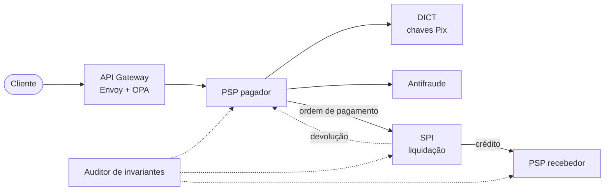

# Urubu do Pix

Pagamentos instantâneos distribuídos, inspirados no Pix. O "urubu do Pix" é o golpe que promete multiplicar o dinheiro enviado; aqui é o contrário: nenhum centavo é criado ou perdido, mesmo com falhas.

Projeto final de **Engenharia de Sistemas Distribuídos 2026.2**.

> **Status:** Projeto 01 (definição do grupo e tema). Ainda não há código executável; o ambiente com Docker Compose chega no Projeto 02.

## O problema

Um pagamento instantâneo atravessa pelo menos três participantes independentes (banco pagador, liquidante central e banco recebedor), cada um com o próprio banco de dados. Ele precisa terminar em segundos e manter a soma dos saldos intacta mesmo com quedas de serviço, timeouts, partições de rede e mensagens repetidas. Como não existe transação distribuída entre instituições, essa garantia tem de vir da arquitetura.

## Visão inicial da arquitetura



| Serviço | Responsabilidade |
|---|---|
| `psp` | Banco simulado: contas de clientes, débito, crédito e Outbox. Uma instância por banco. |
| `spi` | Liquidação atômica entre contas de reserva; orquestra a SAGA do pagamento. |
| `dict` | Diretório de chaves Pix, com cache e limite contra varredura de chaves. |
| `antifraude` | Score de risco de cada pagamento. |
| `auditor` | Verifica os invariantes (conservação de saldo e idempotência) ao fim de cada teste. |

Padrões arquiteturais, tecnologias e critérios de sucesso estão na [proposta do Projeto 01](docs/proposta/proposta-projeto-01.md) ([PDF](docs/proposta/proposta-projeto-01.pdf)).

## Equipe

| Integrante | GitHub | Contato |
|---|---|---|
| Deivison Costa | [@Deivison-Costaa](https://github.com/Deivison-Costaa) | *a preencher* |
| Giancarlo Silveira Cavalcante | [@GianBala](https://github.com/GianBala) | *a preencher* |
| Herlan Alef de Lima Nascimento | [@HerlanLima](https://github.com/HerlanLima) | *a preencher* |
| *Integrante 4* | | |
| *Integrante 5* | | |

### Frentes de trabalho

A divisão por integrante será definida no Projeto 02. As cinco frentes previstas são:

1. **Liquidação:** SPI e livro-razão das contas de reserva.
2. **Bancos e SAGA:** serviço PSP, Outbox e devoluções.
3. **Borda e segurança:** API Gateway, Keycloak, mTLS, OPA e DICT.
4. **Antifraude e entrega:** antifraude, pipeline DevSecOps e canary.
5. **Qualidade:** observabilidade, testes de carga e de caos, auditor de invariantes.

## Entregas

| Entrega | Conteúdo | Data | Peso | Status |
|---|---|---|---|---|
| Projeto 01 | Grupo, tema, proposta e repositório | 09/10/2026 | 10% | em andamento |
| Projeto 02 | C4 (níveis 1 e 2), ADRs iniciais, stack, Docker Compose e CI | 06/11/2026 | 20% | |
| Projeto 03 | Código e testes, documentação final e apresentação presencial | 11/12/2026 | 70% | |

## Estrutura do repositório

```
docs/
  proposta/   proposta do Projeto 01 (Markdown e PDF)
  ia/         registro detalhado do uso de IA
```

As pastas dos serviços, da infraestrutura e dos testes entram a partir do Projeto 02.

## Como executar

Ainda não há o que executar. As instruções entram aqui junto com o Docker Compose, no Projeto 02.

## Convenções

- Commits no formato Conventional Commits (`feat:`, `fix:`, `docs:`, `test:` etc.).
- Cada integrante commita o próprio trabalho: a avaliação individual usa o histórico de commits.

## Ferramentas de IA utilizadas

> Seção obrigatória pelo enunciado; sem ela a entrega é desclassificada. O registro detalhado, entrada por entrada, fica em [docs/ia/registro.md](docs/ia/registro.md).

| Ferramenta | Onde atuou | Como foi orientada | Avaliação |
|---|---|---|---|
| Claude Code (modelo Claude Opus 5.5) | Análise do enunciado, sugestão de temas, redação da proposta e deste README | PDF do enunciado e pedido de ideias complexas alinhadas aos critérios de avaliação | Tema escolhido entre cinco sugestões; as outras quatro foram descartadas. O nome do projeto foi definido pela equipe. Revisão da proposta pela equipe: *a preencher* |
